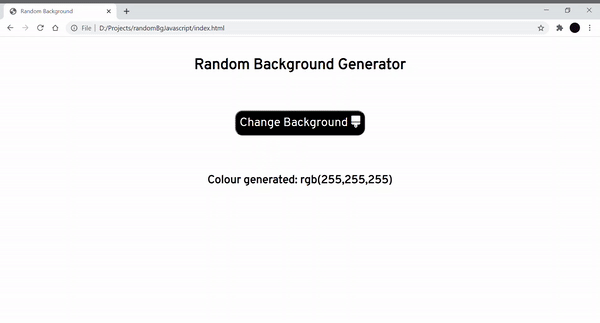

# RandomBgWithJS
A website built using HTML,CSS and Vanilla Javascript that generates random backgrounds on click.
## About
This is a simple website built using basic tools like HTML,CSS and Vanilla Javascript. A set of three values are generated everytime the button on the page is clicked and these three values use Red-Green-Blue(rgb) model to yeild different background colours.The rgb values are also displayed on the webpage and they change along with the background.The inbuilt javascript function random present within the Math object has been used for this website.
## Demo

